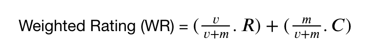

# Introduction  
Kita akan belajar membuat sistem rekomendasi dengan menggunakan Python, data yang akan kita gunakan di sini adalah database film dari imdb lengkap dengan metadatanya.

## Latar Belakang
Terdapat 2 dasar tipe sistem rekomendasi:

1. Sistem Rekomendasi **Sederhana**  
2. Sistem Rekomendasi **Berdasarkan Konten dari Fiturnya**
 
**Sistem Rekomendasi Sederhana**, seperti namanya adalah sistem rekomendasi yang hanya **menggunakan urutan sebagai dasar perhitungannya**, yang biasanya digunakan dalam '5 film terbaik' kita akan menggunakan urutan berdasarkan mungkin vote terbanyak, rating tertinggi, penjualan film paling tinggi, atau apapun yang lain.  
Dalam kasus ini, kita akan menggunakan kombinasi antara rata-rata rating, jumlah vote, dan membentuk metric baru dari metric yang sudah ada, kemudian kita akan melakukan sorting untuk metric ini dari yang tertinggi ke terendah.

### Simple Recommender Engine using Weighted Average  
Simple Recommender Engine menawarkan rekomendasi yang umum untuk semua user berdasarkan popularitas film dan terkadang genre.

Ide awal di balik sistem rekomendasi ini adalah sebagai berikut.

1. Film-film yang lebih populer akan memiliki kemungkinan yang lebih besar untuk disukai juga oleh rata-rata penonton.
2. Model ini tidak memberikan rekomendasi yang personal untuk setiap tipe user. 
3. Implementasi model ini pun juga bisa dibilang cukup mudah, yang perlu kita lakukan hanyalah mengurutkan film-film tersebut berdasarkan rating dan popularitas dan menunjukkan film teratas dari list film tersebut.

Sebagai tambahan, kita dapat menambahkan genre untuk mendapatkan film teratas untuk genre spesifik tersebut

### Formula dari IMDB dengan Weighted Rating
 

dimana,

v: jumlah votes untuk film tersebut  
m: jumlah minimum votes yang dibutuhkan supaya dapat masuk dalam chart  
R: rata-rata rating dari film tersebut  
C: rata-rata jumlah votes dari seluruh semesta film

### Import Library dan File Unloading
Langkah pertama yang harus kita lakukan adalah melakukan import library yang dibutuhkan untuk pengerjaan project ini dan melakukan pembacaan dataset.

Notes :

Library yang akan kita gunakan adalah pandas (as pd) dan numpy (as np)
Dataset yang akan digunakan adalah title.basics.tsv dan title.ratings.tsv

Akses dataset :

- title.basic.tsv = https://storage.googleapis.com/dqlab-dataset/title.basics.tsv
- title.ratings.tsv = https://storage.googleapis.com/dqlab-dataset/title.ratings.tsv

### 5 Data teratas dari table movie
Hal pertama yang akan kita lakukan adalah menampilkan 5 data teratas yang ada pada table movie (movie_df). 

### Info Data dari Setiap Kolom
Setelah berhasil menampilkan 5 data teratas yang ada pada table movie (movie_df), hal selanjutnya yang akan kita lakukan adalah melakukan pengecekan **tipe data dan informasi lainnya dari setiap kolom** yang ada pada **table movie** (movie_df) tersebut.

### Pengecekan Data dengan Nilai NULL
Merupakan suatu hal yang wajib untuk melakukan pengecekan terhadap nilai NULL yang ada di dalam dataset saat melakukan cleaning.

Oleh karena itu, hal selanjutnya yang akan kita lakukan adalah melakukan pengecekan apakah ada **data bernilai NULL pada masing-masing kolom yang ada pada table movie (movie_df)**.

### Analisis Kolom dengan data bernilai NULL - part 1
Dari hasil pengecekan nilai NULL yang sudah dilakukan sebelumnya, diketahui bahwa kolom **primaryTitle** dan **originalTitle** memiliki banyak data yang bernilai NULL.

Hal selanjutnya yang akan kita lakukan adalah melakukan pengecekan terhadap **bentuk data dari kolom primaryTitle dan originalTitle yang bernilai NULL, apakah salah satu atau kedua kolom yang dimaksud ada data yang bernilai NULL.**

### Membuang Data dengan Nilai NULL - part 1
Setelah melihat hasil sebelumnya, dapat dilihat bahwa semua data tidak memiliki judul dan kita dapat membuang data-data tersebut.

Pekerjaan selanjutnya yang akan kita lakukan adalah membuang data dengan nilai NULL tersebut dan melihat jumlah data yang ada setelah data-data bernilai NULL tersebut dibuang. 

### Analisis Kolom dengan data bernilai NULL - part 2
Selain kolom 'primaryTitle' dan 'originalTitle',masih terdapat kolom lain yang memiliki data bernilai NULL. Kolom tersebut adalah kolom 'genres'

Selanjutnya, kita akan melakukan hal yang sama seperti yang sudah kita lakukan pada kolom 'primaryTitle' dan 'originalTitle'.

Lakukan pengecekan terhadap **bentuk data dari kolom genres yang bernilai NULL.**

### Membuang Data dengan Nilai NULL - part 2
Setelah melihat hasil sebelumnya, dapat dilihat bahwa semua data tidak memiliki judul dan kita dapat membuang data-data tersebut.Pekerjaan selanjutnya yang akan kita lakukan adalah membuang data dengan nilai NULL tersebut dan melihat jumlah data yang ada setelah data-data bernilai NULL tersebut dibuang. 

### Mengubah Nilai '\\N'
Jika kita perhatikan pada kolom 'startYear' , 'endYear', dan 'runtimeMinutes', terdapat data dengan nilai '\\N'

'\\N' berarti NULL.

Hal selanjutnya yang akan kita lakukan adalah mengubah nilai dari \\\N tersebur menjadi np.nan dan melakukan casting kolom startYear, endYear, dan runtimeMinutes menjadi float64.

### Mengubah nilai genres menjadi list

Selanjutnya, kita akan membuat sebuah function yang bernama **transform_to_list** untuk mengubah nilai genre menjadi list. 

### Menampilkan 5 data teratas
Seperti yang sudah kita lakukan pada table movie (movie_df) sebelumnya, sekarang kita akan menampilkan 5 data teratas dari table ratings (rating_df)

### Menampilkan info data
Selanjutnya, kita akan menampilkan tipe data dan informasi lainnya dari masing-masing kolom yang ada pada table rating (rating_df)

### Inner Join table movie dan table rating
Mari kita melakukan **inner** join antara rating_df dan movie_df untuk mendapatkan rating pada setiap film yang tersedia, lalu tampilkan **5 data teratas** dan **tipe data** dari tiap kolom yang ada. 

### Memperkecil ukuran Table
Hal selanjutnya yang akan kita lakukan adalah memperkecil ukuran table dengan menghilangkan semua nilai NULL dari kolom **startYear** dan **runtimeMinutes** karena tidak masuk akal jikalau film tersebut tidak diketahui kapan tahun rilis dan durasi nya. 

### Pertanyaan 1: Berapa nilai C?
Hal pertama yang akan kita cari adalah nilai dari C yang merupakan rata-rata dari averageRating

### Pertanyaan 2: Berapa nilai m?
Mari kita ambil contoh film dengan numVotes di atas 80% populasi, jadi populasi yang akan kita ambil hanya sebesar 20%.

### Pertanyaan 3: Bagaimana cara membuat fungsi weighted formula?
Selanjutnya kita harus membuat sebuah fungsi dengan menggunakan dataframe sebagai variable.

### Pertanyaan 4: Bagaimana cara membuat simple recommender system?
Dari task yang sudah kita lakukan sebelumnya, telah terdapat field tambahan 'score'.

Pertama kita akan filter numVotes yang lebih dari m kemudian diurutkan score dari tertinggi ke terendah untuk diambil nilai beberapa nilai teratas

### Pertanyaan 5: Bagaimana cara membuat simple recommender system dengan user preferences?
Dari task yang sudah dilakukan sebelumnya, dapat dilihat sekarang daftar film telah diurutkan dari score tertinggi ke terendah.

Film dengan averageRating yang tinggi tidak selalu mendapat posisi yang lebih tinggi dibanding film dengan averageRating lebih rendah, hal ini disebabkan karena kita juga memperhitungkan faktor banyaknya votes

Sistem rekomendasi ini masih bisa ditingkatkan dengan menambah filter spesifik tentang titleType, startYear, ataupun filter yang lain

Pekerjaan selanjutnya yang akan kita lakukan adalah membuat function untuk melakukan filter berdasarkan isAdult, startYear, dan genres.

